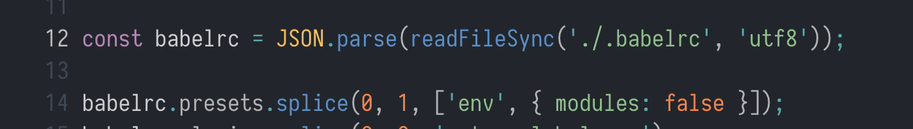
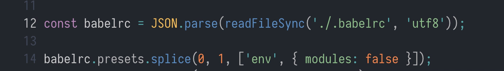
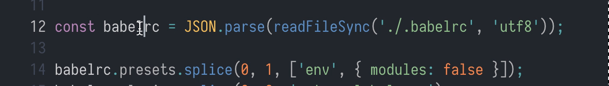

# Wrap Console Log Lite
This extension fork of [Wrap Console Log](https://github.com/midnightsyntax/vscode-wrap-console-log).
Wraps the word near your cursor and replaces it as an argument for `console.log`.

## Key features
* Optimized for keyboard use
* No selection needed
* Doesn't break indent
* Can log variables with and without prefixed text

## Keyboard shortcuts
*Insert console.log on the line below*

### Log
* `Ctrl+Shift+C` + `C`
* 

### Log with string prefix
* `Ctrl+Shift+C` + `P`
* 

### Log as object
* `Ctrl+Shift+C` + `O`
* 
